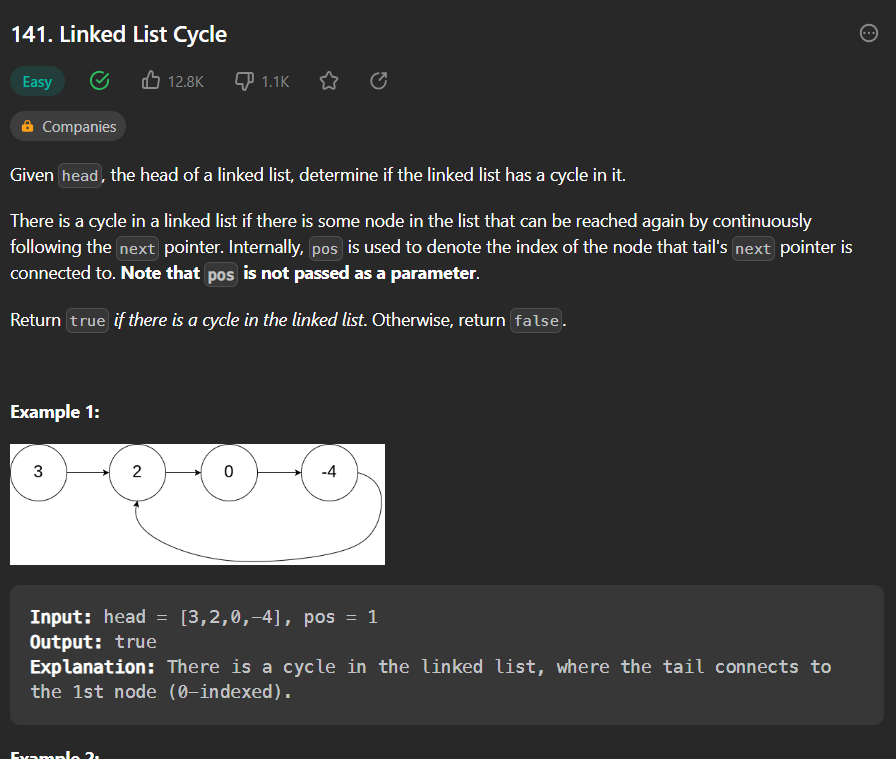

# linked_list
JavaScript Linked List algorithm examples of leetcode:
https://leetcode.com/problems/linked-list-cycle/description/

Writing code for a linked list involves implementing a data structure that consists of a sequence of nodes, where each node contains a value and a reference (or pointer) to the next node in the list. Linked lists are a fundamental data structure used in computer science and programming for efficient storage and manipulation of data.

To begin coding a linked list, you first need to define a node structure or class that represents each element of the list. The node structure typically includes two main components: a data field to hold the value of the node and a next field to store the reference to the next node.

Once you have defined the node structure, you can proceed to create the linked list class or structure itself. The linked list class will have methods or functions to perform various operations on the list, such as inserting a new node, deleting a node, searching for a value, or traversing the list.

When inserting a new node, you will need to consider different cases, such as inserting at the beginning, middle, or end of the list. To insert a node at the beginning, you would update the next reference of the new node to point to the current first node, and then update the reference of the head of the list to point to the new node.

Deleting a node involves updating the references of the previous node and the next node to bypass the node being deleted. If the node to be deleted is the first node, the head reference is updated accordingly. It's important to properly manage memory deallocation when deleting nodes.

Searching for a specific value in a linked list requires traversing through the nodes one by one, starting from the head node, until the value is found or the end of the list is reached. If the value is found, you can return the node containing the value or any other desired information.

Traversing the linked list involves iterating through each node, starting from the head, and performing operations on each node or extracting information from it. This can be done using a loop that continues until the end of the list is reached, which is indicated when the next reference of a node becomes null.

Additionally, you may want to include other utility methods in your linked list implementation, such as checking if the list is empty, obtaining the length of the list, or printing the entire list for debugging purposes.

Writing code for a linked list requires a good understanding of pointers (or references) and memory management, as well as proficiency in the programming language you are using. It is important to consider edge cases and handle error conditions to ensure the correct and efficient operation of the linked list.

Overall, coding a linked list involves designing and implementing the necessary structures, methods, and algorithms to manipulate the list according to your specific requirements. With a well-implemented linked list, you can efficiently store, manipulate, and access data in a dynamic and flexible manner.
